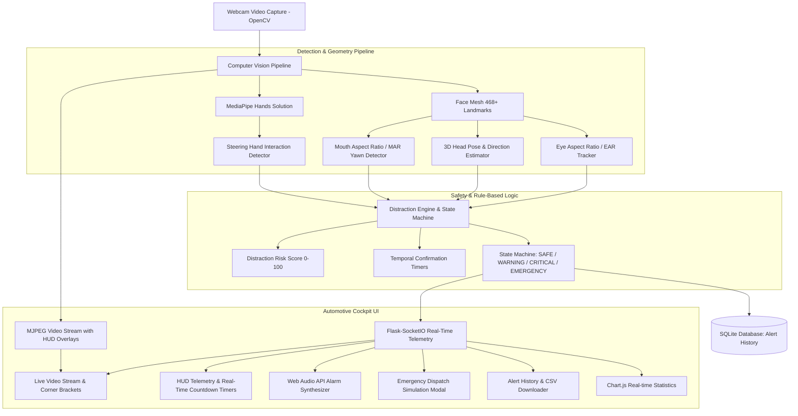

# Vision-Based Distracted Driver Detection System

[](https://www.python.org/)
[](https://flask.palletsprojects.com/)
[](https://opencv.org/)
[](https://developers.google.com/mediapipe)
[](https://getbootstrap.com/)
[](LICENSE)

An intelligent, real-time automotive driver monitoring and safety telematics prototype developed for a **College Mini-Project Demonstration**. The system uses a standard laptop webcam, OpenCV, and Google MediaPipe to analyze driver vigilance, eye closure (EAR), head direction, hands on the steering zone, and sustained yawning (MAR).

---

> [!IMPORTANT]
> **Safety & Demonstration Prototype Notice**:
> This system is an educational prototype and live demonstration platform designed to illustrate computer vision and telematics safety concepts. It is not an automotive certified collision-avoidance system and does not claim to physically stop or steer a vehicle.

---

## 1. System Architecture



---

## 2. Core Computer Vision Methodology

### A. Eye Aspect Ratio (EAR) & Drowsiness Detection
Eye openness is quantified by computing the Euclidean distance ratio between vertical and horizontal eyelid landmarks:

$$\text{EAR} = \frac{\|p_2 - p_6\| + \|p_3 - p_5\|}{2 \cdot \|p_1 - p_4\|}$$

- **Landmark Anchors (MediaPipe Face Mesh)**:
  - Left Eye: `[33, 160, 158, 133, 153, 144]`
  - Right Eye: `[362, 385, 387, 263, 373, 380]`
- **Temporal Filter**:
  - Open eye baseline: $\text{EAR} \approx 0.26 - 0.35$
  - Closed eye: $\text{EAR} < 0.22$
  - Momentary blinks ($<0.45\text{s}$) are counted and ignored.
  - Continuous eye closure $> 2.0\text{s}$ triggers **CRITICAL: DROWSINESS ALERT**.

---

### B. 3D Head Pose Estimation & Looking-Away Detection
Calculates the 3D rotation angles ($\text{Yaw}, \text{Pitch}, \text{Roll}$) of the driver's head by solving the Perspective-n-Point (PnP) problem using `cv2.solvePnP` between 3D facial model anchors and 2D pixel coordinates:

- **Key Landmarks**: Nose tip (`#1`), Chin (`#152`), Left eye corner (`#33`), Right eye corner (`#263`), Mouth corners (`#61`, `#291`).
- **Direction Classification**:
  - $\text{Yaw} < -16^\circ \implies \text{LEFT}$
  - $\text{Yaw} > +16^\circ \implies \text{RIGHT}$
  - Otherwise $\implies \text{CENTER}$
- **Temporal Filter**: Sustained looking away $> 3.0\text{s}$ triggers **DISTRACTION ALERT: DRIVER LOOKING AWAY**.

---

### C. Mouth Aspect Ratio (MAR) & Yawn Detection
Differentiates between talking and sustained fatigue yawning by measuring vertical lip opening against mouth width:

$$\text{MAR} = \frac{\|p_{13} - p_{14}\| + \|p_{37} - p_{84}\| + \|p_{267} - p_{314}\|}{3 \cdot \|p_{61} - p_{291}\|}$$

- **Threshold**: $\text{MAR} > 0.55$ continuously for $\ge 1.2\text{s}$ classifies as **YAWNING DETECTED**.

---

### D. Hand Detection & Steering Zone Interaction
Uses **MediaPipe Hands** to monitor driver hands on the virtual steering area:
- `TWO HANDS`: Safe steering interaction.
- `ONE HAND`: If single-hand driving persists $> 2.0\text{s}$, triggers **WARNING: SINGLE-HAND DRIVING**.
- `NO HANDS`: If zero hands detected, triggers **CRITICAL: HANDS NOT DETECTED**.

---

### E. Rule-Based Distraction Score (0 - 100)
Aggregates driver indicators into an unified real-time risk index:

| Condition | Point Addition |
| :--- | :---: |
| Eyes Closed | $+50$ |
| Looking Left or Right | $+30$ |
| Single-Hand Driving | $+20$ |
| Yawning / Fatigue | $+20$ |
| No Face Visible | $+40$ |
| No Hands Detected | $+40$ |

- **Severity Tiers**: `Normal (0-20)`, `Low (21-40)`, `Moderate (41-60)`, `High (61-80)`, `Critical (81-100)`.

---

## 3. Multi-Tier Safety State Machine

```
   [ NORMAL (Safe) ]
           │
           │ Distraction candidate detected (e.g., 1 hand, yawn, looking away)
           ▼
   [ WARNING (Amber) ]
           │
           │ Prolonged distraction (Eyes closed >2s, Looking away >3s, Hands off)
           ▼
   [ CRITICAL (Red) ]
           │
           │ Critical state continues for > 5.0 seconds
           ▼
[ EMERGENCY SIMULATION ] ──(Driver returns to normal)──► [ NORMAL (Safe) ]
```

---

## 4. Emergency Escalation Simulation

When a critical safety hazard persists for more than **5.0 seconds**, the system automatically engages the simulated emergency escalation protocol:
- Displays an emergency dispatch banner on the dashboard.
- Displays simulated driver telemetry metadata:
  - **Driver ID**: `DRV-DEMO-01`
  - **Event**: `Prolonged Critical Distraction / Eye Closure`
  - **Coordinates**: `37.7749° N, 122.4194° W` (Demo Highway GPS)
  - **Status**: `Simulated Notification Sent to Emergency Services`

---

## 5. Project Directory Structure

```
vision-driver-monitor/
├── app.py                          # Flask & SocketIO Backend Server
├── database.py                     # SQLite Database & Analytics Layer
├── requirements.txt                # Python Dependencies
├── README.md                       # Comprehensive Documentation & Viva Guide
│
├── detection/                      # Computer Vision Modules
│   ├── __init__.py
│   ├── face_detector.py            # MediaPipe Face Mesh & Bounding Box
│   ├── eye_detector.py             # EAR Calculation & Drowsiness Tracker
│   ├── head_pose.py                # 3D Head Pose & Yaw/Pitch/Roll
│   ├── hand_detector.py            # MediaPipe Hands & Steering Monitor
│   ├── yawn_detector.py            # MAR Calculation & Fatigue Yawn Tracker
│   └── distraction_engine.py       # Master Coordinator & HUD Renderer
│
├── templates/
│   └── index.html                  # Automotive Cockpit Dashboard UI
│
├── static/
│   ├── css/
│   │   └── style.css               # Glassmorphism & Neon Telematics Styling
│   └── js/
│       └── dashboard.js            # SocketIO Client, Audio Synth & Chart.js
│
├── database/
│   └── driver_alerts.db            # SQLite Alert History
│
└── tests/
    └── test_detection.py           # Automated Test Suite (EAR, MAR, Scoring, DB)
```

---

## 6. Installation & Execution Guide

### Prerequisites
- Python 3.10 or 3.11 installed.
- Laptop with integrated or USB webcam.

### Step 1: Clone or Navigate to Directory
```bash
cd "c:\Users\kesha\OneDrive\Desktop\Karthik\kart"
```

### Step 2: Create & Activate Virtual Environment
**Windows (PowerShell)**:
```powershell
py -3.11 -m venv venv
.\venv\Scripts\activate
```

### Step 3: Install Dependencies
```bash
pip install -r requirements.txt
```

### Step 4: Run Automated Tests
```bash
python -m pytest tests/test_detection.py -v
```

### Step 5: Start the Web Application
```bash
python app.py
```

### Step 6: Open the Dashboard
Open your web browser and navigate to:
```
http://127.0.0.1:5000
```

---

## 7. College Demonstration Script (Step-by-Step)

Follow this 10-step sequence to deliver a demonstration to evaluators:

1. **System Start**: Launch `python app.py` and open `http://127.0.0.1:5000`. Ensure camera LED turns on.
2. **Normal State**: Look directly at the webcam with hands visible. Point out the dashboard telemetry:
   - `FACE: DETECTED`, `EYES: OPEN (EAR ~0.28)`, `HEAD: CENTER`, `HANDS: TWO HANDS`, `STATUS: SAFE`.
3. **Drowsiness Demonstration**:
   - Close your eyes and keep them closed.
   - Point to the live countdown timer: `Eyes Closed: 1.20 / 2.00 sec`.
   - At $2.0\text{s}$, observe the **DROWSINESS ALERT** trigger, the red dashboard glow, the audio alarm, and the new entry in the **Alert History** table.
   - Open your eyes to observe the system return to `SAFE`.
4. **Head Distraction Demonstration**:
   - Turn your head completely to the left or right.
   - Watch the head timer advance: `Turn Time: 2.10 / 3.00 sec`.
   - At $3.0\text{s}$, observe the **DISTRACTION ALERT: LOOKING LEFT/RIGHT**.
5. **Single-Hand Driving Demonstration**:
   - Lower one hand off camera.
   - After $2.0\text{s}$, observe the **WARNING: SINGLE-HAND DRIVING DETECTED**.
6. **Yawning / Fatigue Demonstration**:
   - Open your mouth wide.
   - Point out the MAR metric jumping above $0.55$ and triggering **YAWNING DETECTED**.
7. **Emergency Escalation Demonstration**:
   - Keep eyes closed for $>5.0\text{s}$ (or click the **Emergency** button in the Evaluation Panel).
   - Observe the **EMERGENCY SAFETY ALERT SIMULATION** panel appear with mock GPS coordinates and simulated emergency contact transmission.
8. **Alert History & Analytics**:
   - Review the recorded alerts in the table.
   - Click **CSV** to demonstrate instantaneous download of the alert report.
   - Highlight the **Chart.js** bar chart showing the statistical distribution of events.

---

## 8. Viva & Interview Questions & Answers

### Q1: What is Eye Aspect Ratio (EAR) and how does it detect drowsiness?
> **Answer**: EAR is a scalar value calculated from 6 Euclidean landmark points surrounding each eye. When eyes are open, EAR typically measures between $0.25$ and $0.35$. When the eyelids close, EAR plummets below $0.22$. By tracking the duration during which $\text{EAR} < 0.22$, the system differentiates between brief involuntary blinks ($<0.45\text{s}$) and genuine microsleep / drowsiness ($>2.0\text{s}$).

### Q2: How does the system compute 3D Head Pose from a 2D webcam image?
> **Answer**: We employ OpenCV's `cv2.solvePnP` (Perspective-n-Point) algorithm. It maps 6 key 2D facial landmarks (nose tip, chin, eye corners, mouth corners) to an established 3D generic facial anatomical model. The algorithm computes the rotation vector ($\vec{r}$) and translation vector ($\vec{t}$), which are decomposed into Euler angles ($\text{Yaw}, \text{Pitch}, \text{Roll}$). Yaw angles exceeding $\pm 16^\circ$ indicate looking left or right.

### Q3: Why is temporal confirmation essential in driver safety systems?
> **Answer**: Real drivers frequently perform normal, harmless actions such as natural blinking, quick mirror checks, shifting gear with one hand, or speaking. If alerts were triggered on single frame detections, the false-alarm rate would be intolerably high. Temporal filters enforce continuous duration thresholds (e.g. 2s for eye closure, 3s for looking away) before confirming an alert.

### Q4: What is the benefit of the Web Audio API synthesizer used here?
> **Answer**: Instead of relying on static audio files that can fail due to browser autoplay policies or missing files, the browser Web Audio API programmatically synthesizes pure audio waveforms (sine/triangle for warning chimes and pulsing sawtooth klaxons) with millisecond precision and a 3-second cooldown to avoid acoustic fatigue.

---

## 9. Limitations & Future Enhancements

### Limitations
1. **Low-Light / Night Conditions**: Standard RGB laptop webcams degrade in darkness.
2. **Steering Wheel Zone Occlusion**: In a desktop environment, hand gestures approximate steering interaction.
3. **Eyewear Reflection**: Heavy polarized sunglasses can obscure eye landmarks.

### Future Enhancements
- **Near-Infrared (NIR) Camera Integration**: Enables 24/7 dark cabin operation.
- **Edge Deployment on Embedded Hardware**: Porting pipeline to NVIDIA Jetson Orin or Raspberry Pi 5 with CAN bus integration.
- **Pupil Gaze Vectoring**: Tracking fine saccadic eye movements to detect cognitive distraction even when the head is facing forward.
